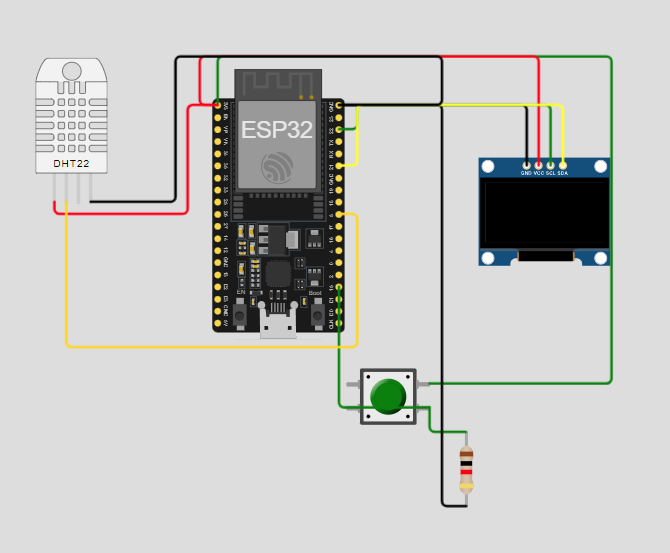

# 🌡️ Sistema de Monitoramento de Umidade e Temperatura com Wi-Fi  
### Projeto Final da Matéria de ARIOT — 1º Semestre

Este projeto é o produto final do primeiro semestre da disciplina **ARIOT (Arquitetura e Redes para Internet das Coisas)**.  
Trata-se de um sistema de **monitoramento de temperatura e umidade** com **exibição em display OLED** e **conectividade Wi-Fi** para sincronização de horário via **NTP (Network Time Protocol)**.

---

## 🧠 Descrição do Projeto

O sistema foi desenvolvido utilizando um microcontrolador **ESP32**, um **sensor DHT11** e um **display OLED SSD1306**.  
Seu objetivo é permitir a leitura e exibição de informações ambientais em tempo real, além de apresentar dados de conexão e relógio sincronizado com servidores de horário via internet.

O usuário pode alternar entre as telas do sistema por meio de um **botão físico**, que alterna entre três modos de exibição:

1. **Informações de Conexão Wi-Fi**  
   - Nome da rede conectada (SSID)  
   - Endereço IP do dispositivo  

2. **Relógio NTP**  
   - Data e hora atualizadas via internet  
   - Exibição do dia da semana  

3. **Leitura do Sensor DHT11**  
   - Temperatura (°C)  
   - Umidade relativa do ar (%)  

---

## ⚙️ Componentes Utilizados

| Componente | Função |
|-------------|--------|
| **ESP32** | Microcontrolador com conectividade Wi-Fi integrada |
| **DHT11** | Sensor de temperatura e umidade |
| **Display OLED SSD1306 (128x64)** | Exibição de dados em tempo real |
| **Botão** | Alternância entre os modos de exibição |
| **Conexão Wi-Fi** | Sincronização de horário via NTP |

---

## 📶 Funcionalidades Principais

- Conexão automática a múltiplas redes Wi-Fi salvas.  
- Exibição de mensagens informativas no display durante o processo de conexão.  
- Leitura em tempo real de **temperatura** e **umidade**.  
- Sincronização de horário com o servidor **pool.ntp.org**.  
- Interface simples e interativa com alternância via botão físico.  
- Exibição gráfica organizada no **display OLED**.

---

## 🧩 Estrutura do Código

O código principal do projeto está localizado no arquivo `.ino`, que realiza as seguintes tarefas:

1. **Inicialização dos periféricos** (Display, DHT11 e Wi-Fi).  
2. **Gerenciamento de redes Wi-Fi** usando a biblioteca `WiFiMulti`.  
3. **Leitura dos sensores** e **exibição dos dados** conforme o modo selecionado.  
4. **Atualização do horário local** via `configTime()` e exibição formatada.  
5. **Controle de interface** por meio do botão físico conectado ao pino 15.

---

## 🖥️ Diagrama de Conexão

O diagrama elétrico do projeto está localizado na pasta `resources`.



---

## 👨‍💻 Autores

- **Otávio V. F. de Souza**  
- **Lucas E. S. Gomes**  
- **Igor T. Souza**  
- **Leonardo Porfirio**

---

## 🧾 Licença e Créditos

Este projeto foi desenvolvido exclusivamente para fins educacionais, no contexto da disciplina de **ARIOT**.  
Sinta-se à vontade para utilizá-lo como referência em estudos e projetos semelhantes.

---

## 🛠️ Tecnologias e Bibliotecas Utilizadas

- [Adafruit_SSD1306](https://github.com/adafruit/Adafruit_SSD1306) — Controle do display OLED  
- [WiFi.h / WiFiMulti.h](https://www.arduino.cc/en/Reference/WiFi) — Gerenciamento de redes sem fio  
- [DHT.h](https://github.com/adafruit/DHT-sensor-library) — Leitura do sensor de temperatura e umidade  
- [time.h](https://www.gnu.org/software/libc/manual/html_node/Time-Functions.html) — Sincronização de horário via NTP  

---

## ⚡ Exemplo de Saída no Display

```
PROJETO FINAL DE IOT
Wifi conectado!
SSID: Tavin Net
IP: 192.168.0.12
```

ou no modo sensor:

```
**** Temperatura ****
C: 24.7
* Umidade Relativa *
58%
```

---

📁 **Estrutura de Pastas Recomendada**

```
📦 Projeto-ARIOT
 ┣ 📜 ProjetoFinal.ino
 ┣ 📂 resources
 ┃ ┗ 🖼️ diagrama-conexão.png
 ┗ 📜 README.md
```
